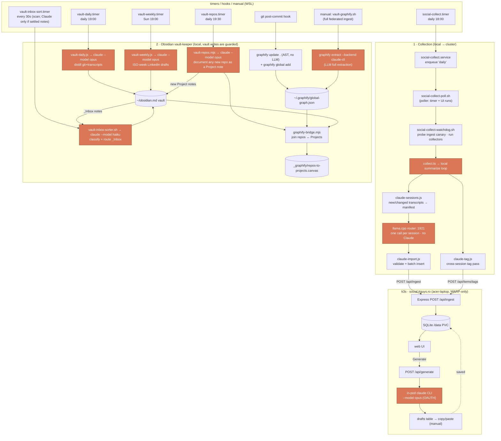

# Social Journal

[](https://github.com/dustfeather/social-update/actions/workflows/deploy.yml)

Turn sporadic posting into a weekly habit. A daily agent run summarizes your Claude Code
sessions into a SQLite DB; a web UI generates copy-ready LinkedIn drafts on demand.

**Nothing is auto-published.** No posting APIs — you copy/paste the drafts yourself.

## How it works

The DB + web UI + generation run on the k3s cluster (`https://social.itguys.ro`, WARP-only).
Collection stays on your machine — it reads `~/.claude/projects` — and **pushes** what it
finds to the cluster over the WARP network:

```
 local machine                          │  k3s (social-update ns, acer-laptop)
 ─────────────                          │  ────────────────────────────────────
 collect agent ──POST /api/ingest───────┼──► Express ──► SQLite (/data PVC)
  ├ sub-agent per session (INGEST_URL)  │       ▲              │
  ├ claude-import.js                    │       │   web UI ──► POST /api/generate
  └ claude-tag.js ──POST /api/items/tags┤       │              │
                                        │       │     in-pod `claude` CLI ──► drafts
 browser (WARP) ──https://social.itguys.ro──────┘                            (copy/paste)
```

- **Collection** is an agent run, not a parser — see "Collection" below. One `items` row per
  Claude Code session, keyed `UNIQUE(source, external_id)` on the session id, upserted so a
  session that grows gets a fresh summary. With `INGEST_URL` set it POSTs to `/api/ingest`;
  unset, it writes a local DB (dev).
- **Generate** sends a week's items + your manual notes + `prompt.txt` to the `claude` CLI
  running **in the cluster pod** (auth via `CLAUDE_CODE_OAUTH_TOKEN`), which returns a JSON
  array of drafts. Each generation is saved to `drafts`.

### Flow: collectors, Obsidian, and where Claude fires

Three independent loops run on the machine. Nodes where **Claude is actually invoked** are
highlighted — most automation is plain deterministic code; the model is called at only a few
points (the in-pod drafter, the vault-keeper writers/sorter, and graphify).



> Highlighted = a `claude` process runs. Note graphify: the **post-commit hook is AST-only, no
> LLM** (`graphify update` + `global add`) — Claude is *not* called on commit. The LLM backend
> (`graphify extract --backend claude-cli`) runs only on the **manual** full ingest. `SRC_CW`
> Collection is **no longer** a Claude call: it loops over a local model on the llama.cpp
> router (`LLM_BASE_URL`), so the box needs a GPU rather than a Claude session. The genuine
> model calls left are the in-pod Opus drafter (`/api/generate`), the cross-session tag pass
> (`collect:tag`, run by hand), and the vault-keeper writers (daily/weekly/repo-doc = Opus,
> inbox = Haiku).
>
> **Keeping the graph fresh:** each repo's slice of `global-graph.json` is refreshed on
> every commit by its AST post-commit hook (`VGH`). The daily `vault-repos` job (`T5`) then
> documents any newly-added repo as a Project note (Opus) and re-runs `graphify-bridge.mjs`
> (`BR`) to rebuild the bridged `graph.html` + the `repos-to-projects.canvas` (the native,
> clickable Obsidian view). The `.canvas` reads vault Projects live, so it is always current;
> the bridged `graph.html`'s vault nodes refresh on the next full `vault-graphify` ingest.

## Prerequisites (collector machine)

- Node.js (run inside WSL).
- **`claude` CLI**, authenticated — collection *is* an agent run (draft generation still
  happens in the cluster pod, not here).
- `~/.claude/projects` present (Claude Code session logs).
- WARP connected (so the run can reach `INGEST_URL` on the cluster).

## Setup

```bash
cp .env.example .env      # adjust paths/port if needed
npm install
npm run build:all         # compiles backend (tsc) + builds web/ (vite)
```

### `.env`

| Key | Meaning |
|-----|---------|
| `CLAUDE_PROJECTS` | Claude Code session logs root (`~/.claude/projects`). The collection source. |
| `CLAUDE_WORK_DIR` | Scratch dir for the manifest, summaries, tags and the state file (default `~/.cache/social-update/claude`). |
| `CLAUDE_LOOKBACK_DAYS` | Sessions older than this are never summarized (default 14). The only brake on fan-out width — a first run with an empty state file summarizes everything inside the window. |
| `CLAUDE_AGENT_TIMEOUT_MIN` | Hard ceiling on the orchestrating agent (default 45). On timeout the run salvages whatever summaries exist. |
| `VAULT_PATH` | Obsidian vault root — used by the vault-keeper scripts, not by collection. `~` and `$HOME` are expanded; quote paths with spaces. |
| `INGEST_URL` | Cluster base URL. Set → POST to `/api/ingest`; unset → write a local SQLite file. |
| `PORT` | Web server port. |
| `DB_PATH` | SQLite file location (local runs only). |

## Usage

```bash
npm run collect    # one collection run (spawns the agent) → upserts into the DB
npm start          # serve API + web UI at http://localhost:$PORT
```

The individual steps, for debugging a run by hand:

```bash
npm run collect:sessions   # scan → ~/.cache/social-update/claude/manifest.json
npm run summary:validate ~/.cache/social-update/claude/summaries
npm run collect:import     # validate every summary + batch insert
npm run collect:tag        # apply ~/.cache/social-update/claude/tags.json
```

Open the UI, pick a week, optionally add manual (work/NDA) items the collectors can't see,
and click **Generate**. Copy any draft card.

### Dev

```bash
npm run dev                  # backend tsc --watch
npm --prefix web run dev     # vite dev server (proxies /api → :4000)
```

## Scheduling (daily collection)

The collector runs from a **WSL `systemd --user` timer** (`social-collect.timer`, daily at
18:00). It calls a watchdog wrapper (`scripts/social-collect-watchdog.sh`, modeled on the WARP
mesh watchdog) that probes ingest health, runs the collector, flags any failed source, and logs
everything to journald. `Persistent=true` makes a missed run (WSL down at 18:00) fire on the
next boot instead of being silently skipped.

Install / update (run inside WSL from the repo root):

```bash
scripts/install-collector-systemd.sh
```

Inspect:

```bash
systemctl --user list-timers social-collect.timer   # next/last fire
systemctl --user start social-collect.service        # run now
journalctl --user -t social-collect -n 30            # run logs
```

> Requires `systemd=true` in `/etc/wsl.conf` and `loginctl enable-linger` (the installer sets
> linger). The unit files live under `scripts/systemd/` so they're version-controlled and can't
> silently disappear the way the old Windows Scheduled Task did.

### Collection: what actually runs

`npm run collect` does not parse anything itself, and it no longer spends Claude on this.
It scans for session transcripts that are new or have grown since the last successful import,
writes a manifest, and then walks them one at a time against a **local** model:

1. **Excerpt** — `src/excerpt.ts` renders each transcript deterministically: `attachment`
   lines, `thinking` blocks and sub-agent sidechains dropped, tool calls kept as one line
   each, and a 24k-character budget spent tail-first, because the last turns are what was
   concluded and the first are only what was asked. The same transcript always yields the
   same bytes, so a bad summary is reproducible.
2. **Summarize** — `src/summarize.ts` sends it to the llama.cpp router from the `ollama-k3s`
   repo (`LLM_BASE_URL`, default `http://127.0.0.1:1921/v1`). The collector loads the model
   before the first session and unloads it after the last — but only if *it* loaded it; a
   model found already resident belongs to whoever loaded it and is left alone.
3. **Self-correct** — the reply is checked with the real `validateSummary`, and a rejected
   one goes back to the model with the validator's own errors as a correction turn, up to
   `LLM_ATTEMPTS` times. Measured 100% valid on the first attempt over a stratified
   12-session sample (`bench/`).
4. **Import in batches** — every `CLAUDE_IMPORT_BATCH` summaries (default 10) are written to
   the DB and their state entries advanced. A session whose summary is missing or invalid
   keeps its state entry and comes back on the next run; nothing is silently lost.
5. **Tag** — *not* part of the run any more. Tagging is a judgement call **across** sessions
   (a tag is only useful if two sessions about the same thing get the same one), so it stays
   a Claude job: write `<work dir>/tags.json` and run `npm run collect:tag`.

Why a local model instead of `claude -p` fanning out a sub-agent per session: reading a
transcript and filling a six-field schema is the mechanical half of the pipeline. Moving it
off Claude leaves Claude for the half that needs judgement — drafting posts and tagging — and
buys determinism and a loop with no tool surface for a transcript to inject into.

Why a summary instead of a parse: the original collector took each session's **first prompt**
as the item — the question, never the answer. The summary is built from the whole transcript,
so a week's items say what was actually done.

#### Surviving an interrupted run

A full backlog is ~300 sessions at ~60-70s each, so a first run is **hours**, and it must be
able to die in the middle. Three things make that cheap:

- `<work dir>/summaries/` is never wiped. Completed summaries outlive the process.
- `<work dir>/progress.json` records the transcript fingerprint (mtime + size) each summary
  was written from, written atomically via write-then-rename. On the next run a summary is
  reused **only** if its session is byte-for-byte unchanged — a session that has since grown
  is summarized again, because importing the older summary would advance state past the new
  turns and they would never be summarized at all.
- State advances every batch, not once at the end. A crash costs at most one batch, and
  `SIGINT`/`SIGTERM` release the model and commit what is done before exiting.

So the recovery procedure is just: run it again.

Cost control lives in `CLAUDE_LOOKBACK_DAYS`, `CLAUDE_COLLECT_BUDGET_MIN` and the state file.
The budget is a wall-clock brake, not a deadline: whatever was summarized is imported and the
rest stay pending, so a nightly timer can chip away at a backlog across several runs.

> The state file (`<work dir>/state.json`) advances only for sessions that actually landed in
> the DB. Delete it to force a full re-summarize of the window.

### Legacy: Windows Task Scheduler (deprecated)

`scripts/collect-task.cmd` + a `SocialJournalCollect` task was the old mechanism. It is
**disabled** in favor of the systemd timer (avoid running both — harmless duplicate inserts via
the dedup constraint, but confusing). To fall back: `schtasks /Change /TN "SocialJournalCollect"
/ENABLE` and disable the systemd timer with `systemctl --user disable --now social-collect.timer`.

## Deployment (k3s)

The app (DB + UI + generation) runs on the itguys k3s cluster, deployed by GitHub Actions
(`.github/workflows/deploy.yml`) on push to `main`. The workflow runs on the in-cluster
`arc-df-social-update` ARC runner and `kubectl apply`s `deploy/` using the runner SA.

Exposure mirrors the cluster convention (e.g. `grafana.itguys.ro`): a per-app
`nginx-tls-proxy` pinned to `acer-laptop` binds that node's `:443` and reverse-proxies to
the app; a cert-manager `Certificate` (`social.itguys.ro`, DNS-01 via
`letsencrypt-cloudflare`) provides TLS; a Cloudflare **DNS-only** A record
`social.itguys.ro → 100.96.0.4` (acer Mesh IP) makes it reachable **only inside WARP**.
SQLite lives on a node-local `local-path` PVC, so the app + proxy + PVC all pin to
`acer-laptop`.

### One-time bootstrap (cluster-admin)

```bash
# 1. Provision the ARC runner scale set for this repo. Clone a sibling's values
#    (prebaked runner image + privileged dind for `docker build` + acer nodeSelector)
#    and swap only the repo URL — siblings reuse the dustfeather App secret.
helm -n arc-runners get values arc-df-uninsta -a | tail -n +2 > /tmp/vals.yaml
sed -i 's#github.com/dustfeather/uninsta#github.com/dustfeather/social-update#' /tmp/vals.yaml
helm -n arc-runners install arc-df-social-update \
  oci://ghcr.io/actions/actions-runner-controller-charts/gha-runner-scale-set \
  --version 0.14.1 -f /tmp/vals.yaml

# 2. RBAC: namespace + runner-SA deploy grants + refresher SA/Role.
kubectl apply -f deploy/ci-rbac.yaml
kubectl apply -f deploy/ghcr-pull-refresher/00-rbac.yaml

# 3. Copy the GitHub App secret so the refresher can mint ghcr pull tokens here.
kubectl get secret github-app-dustfeather -n arc-runners -o yaml \
  | sed 's/namespace: arc-runners/namespace: social-update/' \
  | kubectl apply -n social-update -f -

# 4. Actions secret for in-pod generation.
gh secret set CLAUDE_CODE_OAUTH_TOKEN -R dustfeather/social-update

# 5. Cloudflare DNS-only A record: social.itguys.ro -> 100.96.0.4 (proxied=false).
```

After that, every push to `main` builds the image (`ghcr.io/dustfeather/social-update`),
refreshes the `ghcr-pull` credential, and applies the workload. The private image is pulled
via `ghcr-pull`, kept fresh by the in-namespace `ghcr-pull-refresher` CronJob (GitHub App,
no human PAT).

### Pointing collectors at the cluster

Set `INGEST_URL="https://social.itguys.ro"` in the collector machine's `.env`. The run then
POSTs summaries to `/api/ingest` and tags to `/api/items/tags` instead of opening a local DB
(no token — WARP is the gate).

## Data model

- **`items`** — `source, external_id, title, body, url, occurred_at, iso_week, collected_at,
  raw_json, ignored, tags`. `iso_week` is the ISO week of `occurred_at`, so late collection
  files items into the week they actually happened — and an upsert deliberately leaves it
  alone, so a session resumed weeks later does not migrate out of a week already drafted.
  `tags` is a JSON array assigned by the run's tagging pass; NULL means "not tagged yet".
  Rows from the retired `github`, `obsidian` and `claude-web` sources are still there — the
  history is kept, only the collectors are gone.
- **`drafts`** — `created_at, iso_week, input_snapshot, prompt_used, output` (JSON draft array).

## Voice

`prompt.txt` holds the generation voice instruction (first-person, concrete, no marketing
hype). It is backend-only — edit it by hand; it is not surfaced in the UI.
